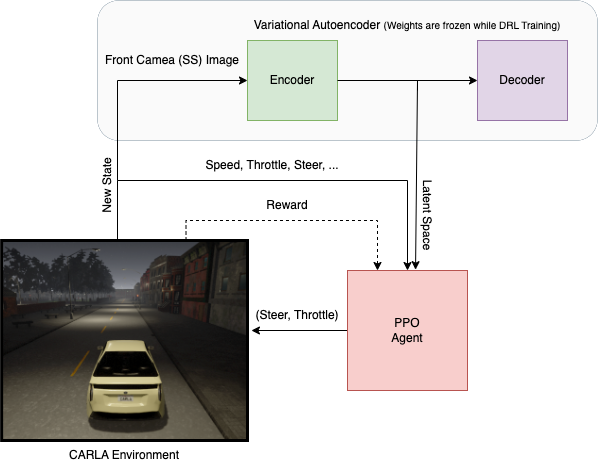
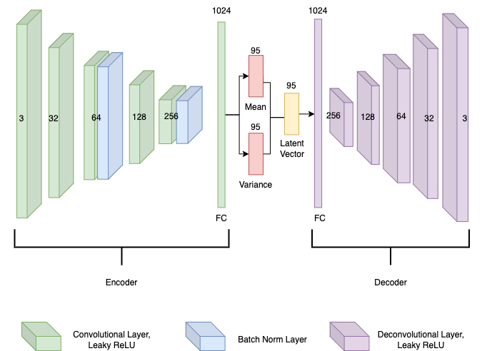

# <p align="center"> Implementing a Deep Reinforcement Learning Model for Autonomous Driving </p>

Artificial Intelligence (AI) is growing extraordinarily in almost every area of technology, and research into self-driving cars is one of them. In this work, we will take the liberty to utilize state-of-the-art methods to train our agent to drive autonomously using the Deep Reinforcement Learning (DRL) approach. We will use an open-source simulator, [CARLA](http://carla.org/), to conduct our experiment, providing a hyper-realistic urban simulation environment to train our models. We cannot use our raw algorithms in the real world because they come with many risks and moral questions, so we use these simulators to help us test them.

Moreover, DRL has shown promising results in learning complex decision-making tasks, from strategic games to challenging puzzles. Here, we will look at how an on-policy DRL algorithm called Proximal Policy Optimization (PPO) will be used in a simulated driving environment to learn to navigate on a predetermined route. The primary goal of this work is to investigate how a DRL model can train an agent on a continuous state and action space. Our main contribution is a PPO-based agent that can learn to drive reliably in our CARLA-based environment. In addition, we also implemented a Variational Autoencoder (VAE) that compresses high-dimensional observations into a potentially easier-to-learn low-dimensional latent space that can help our agent learn faster.


## About the Project

This work aims to develop an end-to-end solution for autonomous driving that can send commands to the vehicle to help it drive in the right direction and avoid crashes as much as possible, and is divided in the following components:

1. CARLA Environment setup.
2. Variational Autoencoder.
3. Proximal Policy Optimization.

We have used [CALRA](http://carla.org/) (version 0.9.8) as our environment (Urban Simulator). We have also summarized some results and analyses to simplify this problem further.

Find the documented work [here](info/documentation/%5BThesis%202022%5D%20IMPLEMENTING%20A%20DEEP%20REINFORCEMENT%20LEARNING%20MODEL%20FOR%20AUTONOMOUS%20DRIVING.pdf) to better understand this whole project.


### Prerequisites

We're using [CARLA](https://github.com/carla-simulator/carla/releases) (0.9.8) + Additional Maps. We're mainly focused on two towns which are Town 2 and Town 7, therefore we'd advice you download Additional Maps file alongside the CARLA server. You can copy/paste the maps from **Additional Maps** directory to **Main** CARLA directory to ensure everything is seemless.

Moving forth we'd advice you to setup your project on **Windows** or **Linux** as these are the two OSs supported by CARLA at the moment. 

## Project Setup (Installations)

In order to setup this project you're advised to clone this repository and make sure you have **Python v3.7.+ (64bit)** version installed. After clonding this repository we can create a python virtual environment for this project 💥 let's call it **venv** `python -m venv venv`. You can call it something else if you want :) Now we can activate our virtual env `source venv/Script/activate`, and don't forget to do so before installing any of the dependencies. Moving forward we can install the dependencies with `pip` with the following command `pip install -r requirements.txt`. We're not only using **pip** as our depency manager but **poetry** as well, therefore execute the following command `cd poetry/ && poetry update` in the repo. This will install all the other dependencies now with **poetry**. Once everything is setup up we're nearly there! 

Download the **CARLA server (0.9.8)** + **Additional Maps**, and make sure you've read the Prerequisites of this repo. Once the server is up and running, we can start our client with `python continuous_driver.py --exp-name=ppo --train=False` command. Don't forget to start the Carla server beforehand. Yey!!!

## Built With

* [Python](https://www.python.org/downloads/release/python-370/) - Programming language
* [PyTorch](https://pytorch.org/) - Open source machine learning framework
* [CARLA](http://carla.org/) - An urban driving simulator
* [Poetry](https://python-poetry.org/) - Packaging and dependency manager
* [Tensorboard](https://www.tensorflow.org/tensorboard) - Visualization toolkit


# Methodology

Architectural layout encapsulating the three most essential components: 

1. CARLA Simulation. 
2. VAE. 
3. PPO Agent.

<p align="center"> </p>
<p align="center"> Architectural Methodology</p>


## How to Run

## Running a Trained Agent

With the project, we provide you two pretrained PPO agents, one for each town (Town 02 & Town 07).
The preTrained serialized files for this model are placed in `preTrained_models/PPO/<town>` folder.

```
python continuous_driver.py --exp-name ppo --train False
```

By deafult we are on Town 07 but we can changed it to Town 02 with the following argument addition:

```
python continuous_driver.py --exp-name ppo --train False --town Town02
```

## Training a New Agent

In order to train a new agent use the following command:

```
python continuous_driver.py --exp-name ppo
```

This will start training an agent with the default parameters, and checkpoints will be written to `checkpoints/PPO/<town>/` and the other metrics will be logged into `logs/PPO/<town>/`. Same as above, by default we're training on Town07 but we can change it to Town02 with this argument addition `--town Town02`.

### How our Training looks like.

<p align="center"> </p>
<p align="center">Town 7</p>
<div>
</div>
<p align="center"> </p>
<p align="center">Town 2</p>

## Variational AutoEncoder

The Variational Autoencoder (VAE) training process starts by driving around automatically and manually, collecting 12,000 160x80 semantically segmented images we will be using for training. Then, we will use the SS image as the input to the variational autoencoder (h ∗ 𝑤 ∗ 𝑐 = 38400 input units). VAE’s weights are frozen while our DRL network trains.

<p align="center"> </p>
<p align="center"> Variational Autoencoder </p>

### Once we have trained our VAE, we can use the following command to check out the reconstructed images:

```
cd autoencoder && python reconstructor.py
```
<p align="center"> </p>
<p align="center"> Original Image to Reconstructed Image </p>


## Project Architecture Pipeline (Encoder to PPO)

The folloing diagram depicts the VAE+PPO training pipeline. Note: all the variable names are missing the subscript 𝑡.

<p align="center"> </p>
<p align="center"> VAE + PPO training pipeline </p>


# File Overview

| File                          | Description                                                                                                           |
| ------------------------------| --------------------------------------------------------------------------------------------------------------------- |
| continuous_driver.py          | Script for training/testing our continuous agent e.g. PPO agent                                                       |
| discrete_driver.py            | Script for training our discrete agent e.g. Duelling DQN agent (*work in progress*)                                   |
| encoder_init.py               | script that uses the trained Encoder to turn the incoming images (states) into latent space                           |
| parameters.py                 | Contains the hyper-paramters of the Project                                                                           |
| simulation/connection.py      | Carla Environment class that makes the connection with the CARLA server                                               |
| simulation/environment.py     | CARLA Environment class that contains most of the Environment setup functionality (gym inspired class structure)      |
| simulation/sensors.py         | Carla Environment file that contains all the agent's sensor classes (setup)                                           |
| simulation/settings.py        | Carla Environement file that contains environment setup parameters                                                    |
| runs/                         | Folder containing Tensorboard plots/graphs                                                                            |
| preTrained_models/ppo         | Folder containing pre-trained models' serialized files                                                                |
| networks/on_policy/agent.py   | Contains code of our PPO agent                                                                                        |
| networks/on_policy/ppo.py     | Contains code of our PPO network                                                                                      |
| logs/                         | Folder containing the logged metrics of our agent while training                                                      |
| info/                         | Folder containing figures, gifs, diagrams, & documentation of the project                                             |
| checkpints/                   | Folder containing serialized parameters of our agent saved while training                                             |
| carla/                        | Folder containing CARL egg file, that is used in order to make connection with the server                             |
| autoencoder/                  | Folder containing the code for our Variational Autoencoder (VAE)                                                      |


## To view the training progress/plots in the Tensorboard:

```
tensorboard --logdir runs/
```

## Authors

**Idrees Razak** - [GitHub](https://github.com/idreesshaikh), [LinkedIn](https://www.linkedin.com/in/idreesrazak/)

## License

This project is licensed under the MIT License - see the [LICENSE.md](LICENSE.md) file for details

## Acknowledgments

I thank, **Dr. Toka László**, for his exceptional leadership and unwavering support during this work.